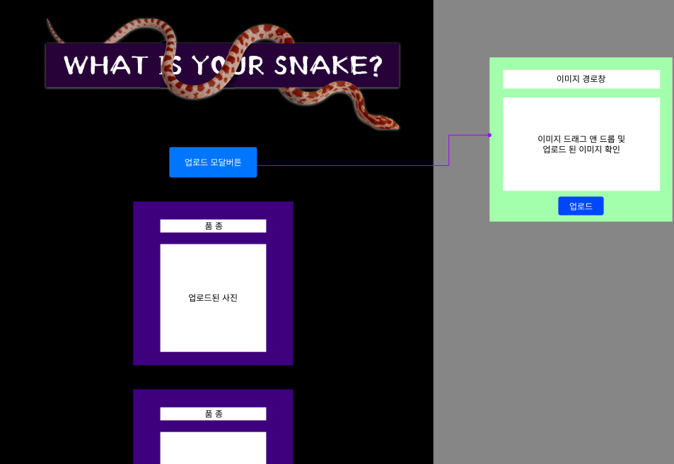

## ✨ Team\_ 호빈교

### 목표

-   인스타그램 주요기능 및 UI 클론
-   GitHub 활용 및 효율적인 분업
-   Back-End 이해도 높이기

### 개발 기간

-   05.18.22 ~ 05.24.22

### 멤버구성 & 파트분배
-   AI 담당자 ->
-   Front-End -> 
-   Back-End -> 이호빈, 백우진, 문명주, 최준헌

-   이호빈 
-   백우진 
-   문명주 
-   최준헌 

### 적용

      

### 소통

### 레이아웃

### 구현 기능

**index.html**

1. 모달 기능
2. 이미지 업로드 
3. 게시물 포스팅

